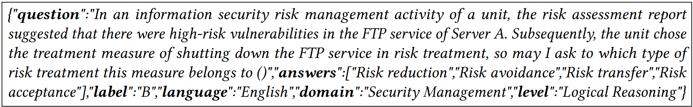
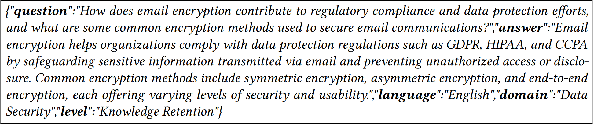
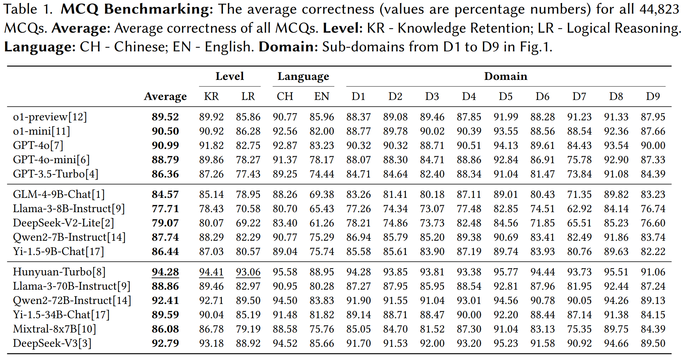
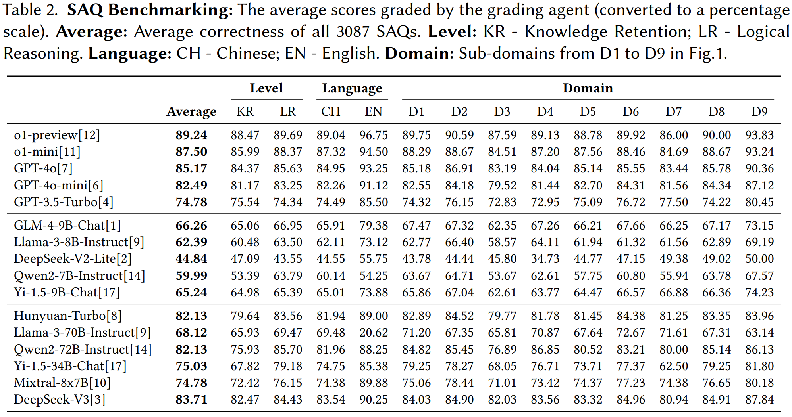

# SecBench: A Comprehensive Multi-Dimensional Benchmarking Dataset for LLMs in Cybersecurity

Evaluating Large Language Models (LLMs) is crucial for understanding their capabilities and limitations across various applications, including natural language processing and code generation. Existing benchmarks like MMLU, C-Eval, and HumanEval assess general LLM performance but lack focus on specific expert domains such as cybersecurity. Previous attempts to create cybersecurity datasets have faced limitations, including insufficient data volume and a reliance on multiple-choice questions (MCQs). To address these gaps, we propose SecBench, a multi-dimensional benchmarking dataset designed to evaluate LLMs in the cybersecurity domain. SecBench includes questions in various formats (MCQs and short-answer questions (SAQs)), at different capability levels (Knowledge Retention and Logical Reasoning), in multiple languages (Chinese and English), and across various sub-domains. The dataset was constructed by collecting high-quality data from open sources and organizing a Cybersecurity Question Design Contest, resulting in 44,823 MCQs and 3,087 SAQs. Particularly, we used the powerful while cost-effective LLMs to (1). label the data and (2). constructing a grading agent for automatic evaluation of SAQs. Benchmarking results on 16 SOTA LLMs demonstrate the usability of SecBench, which is arguably the largest and most comprehensive benchmark dataset for LLMs in cybersecurity.


SecBench official website: <a href="https://secbench.org/" target="_blank">link</a>.


SecBench Technical Paper: <a href="https://arxiv.org/abs/2412.20787" target="_blank">link</a>.


## Table of Contents

- [SecBench Design](#secbench-design)
- [Data Example](#data-example)
- [Benchmarking](#benchmarking)
- [Released Data](#released-data)
- [Citation](#citation)
- [Credit](#credit)


## SecBench Design


The following figure shows the overview of the SecBench design: it is a comprehensive benchmarking dataset aiming to benchmark LLM's capability in cybersecurity from *Multi-Level*, *Multi-Language*, *Multi-Form*, *Multi-Domain*.


- **Multi-Level** : We devise the capability of LLM in cybersecurity into two different levels: **Knowledge Retention - KR** and **Logical Reasoning - LR**. Among the two, knowledge retention examines the LLM's ability to retain existing knowledge. The content of such questions is relatively straightforward and does not involve complex reasoning. On the other hand, logical reasoning assesses the LLM's ability to infer the correct answer based on the given information. The difficulty of these questions is relatively higher and better demonstrates the model's capability to handle complex problems.


- **Multi-Language** : SecBench includes questions of two mainstream languages - Chinese and English, to present a more comprehensive benchmark.

- **Multi-Form** : Unlike previous works that constructed only multiple-choice questions (MCQs), SecBench also includes short-answer questions (SAQs) to present a more comprehensive evaluation. This is because SAQs tend to be more challenging than MCQs: for MCQs, the LLM only needs to choose the correct answer(s) from the given options, while for SAQs, the LLM is prompted to construct its own answer based on the given question. As a result, SAQs can evaluate the capability of the LLM at a higher level, especially considering the inherent limitations of LLMs (e.g., hallucinations and repetition).


- **Multi-Domain** : The questions in SecBench consist of 9 different domains, including **D1. Security Management**, **D2. Data Security**, **D3. Network and Infrastructure Security**, **D4. Security Standards and Regulations**, **D5. Application Security**, **D6. Identity and Access Control**, **D7. Fundamental Software and Hardware and Technology**, **D8. Endpoint and Host Security**, **D9. Cloud Security**. Particularly, the above domains were devised from several rounds of brainstorming and revision, which were expected to cover most (if not all) related sub-domains in cybersecurity. Note that we do not expect these domains to be \emph{orthogonal}, and it is possible that one question can be reasonably labeled into different domains. In our dataset, one question is assigned only one most-related domain label from D1 to D9.

## Data Example


### MCQ Example

Following is one MCQ example, labeled in the domain of *Security Management* and the level of *Logical Reasoning*. For MCQs, A blank is left in question stem, and there are four choices given in *answers* for the tested LLM to select, with *label* referring to the correct choice(s) among the four.




### SAQ Example

Following is one SAQ example, labeled in the domain of *Data Security* and the level of *Knowledge Retention*. For SAQs, there is no choice given for selection, and the tested LLM is expected to construct the answer from scratch. in SAQ, *answer* refers to the correct answer of the question stem, which will be used to evaluate LLM's output.





## Benchmarking

Based on SecBench, we conducted extensive benchmarking on 16 SOTA LLMs, including the GPT series and competitive open-source ones.


### MCQ Correctness



### SAQ Scores




## Released Data

We release a total of 3,000 questions from SecBench (under the [data](./data/) folder), including:

 - [MCQs_2730.jsonl](./data/MCQs_2730.jsonl) : A total of 2,730 MCQs.

 - [SAQs_270.jsonl](./data/SAQs_270.jsonl) : A total of 270 SAQs.


**Note :** The released SecBench dataset is also accessible via the <a href="https://huggingface.co/datasets/secbench-hf/SecBench" target="_blank">huggingface link</a> and <a href="https://zenodo.org/records/14575303" target="_blank">zenodo link</a>.


## Citation


```bibtex
@article{jing2024secbench,
  title={SecBench: A Comprehensive Multi-Dimensional Benchmarking Dataset for LLMs in Cybersecurity},
  author={Jing, Pengfei and Tang, Mengyun and Shi, Xiaorong and Zheng, Xing and Nie, Sen and Wu, Shi and Yang, Yong and Luo, Xiapu},
  journal={arXiv preprint arXiv:2412.20787},
  year={2024}
}
```


## Credit

