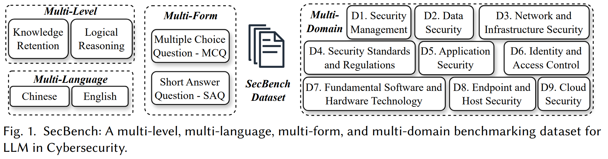
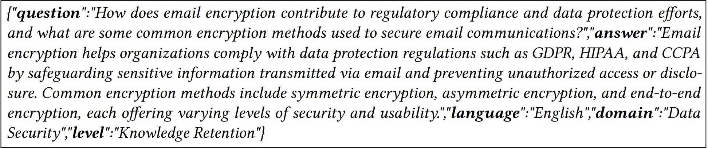

# SecBench：大规模+多维度全面评测大模型网络安全能力

[English README](./README.md)

评估大型语言模型（LLMs）对于理解其在各种应用中的能力和局限性至关重要，包括自然语言处理和代码生成。现有的基准如MMLU、C-Eval和HumanEval评估了LLM的一般性能，但缺乏对特定专家领域如网络安全的关注。之前创建网络安全数据集的尝试面临着数据量不足和依赖选择题（MCQs）的限制。为了解决这些问题，我们提出了SecBench，一个大规模+多维度的基准数据集，旨在评估LLMs在网络安全领域的表现。SecBench的数据包括各种格式（选择题 - MCQs 简答题 - SAQs），不同能力水平（知识记忆和逻辑推理），多种语言（中文和英文），以及多个子领域的问题。该数据集通过从开放资源中收集高质量数据和组织网络安全问题设计竞赛构建，最终包含了44,823条选择题和3,087条问答题。特别是，我们使用了强大且成本效益高的LLMs来（1）标注数据和（2）构建自动评估问答题分数的评分Agent。通过对16个SOTA LLMs的基准测试，我们展示了SecBench的可用性。SecBench是目前最大的、最全面的LLM网络安全基准数据集，从质和量两方面对现有的网络安全能力评测数据进行了补充。


SecBench官网链接: <a href="https://secbench.org/" target="_blank">link</a>.


SecBench技术文章: <a href="https://arxiv.org/abs/2412.20787" target="_blank">link</a>.


## 目录

- [SecBench设计](#secbench设计)
- [数据示例](#数据示例)
- [基准测试](#基准测试)
- [发布数据](#发布数据)
- [引用](#引用)
- [致谢](#致谢)


## SecBench设计


下图展示了SecBench设计的概述：这是一个全面的基准数据集，旨在从*多层次*、*多语言*、*多形式*、*多领域*评估LLM在网络安全方面的能力。





- **多层次**：我们将LLM在网络安全方面的能力分为两个不同的层次：**知识记忆 - KR**和**逻辑推理 - LR**。其中，知识记忆考察LLM获取其现有知识的能力。这类问题的内容相对简单，不涉及复杂的推理。另一方面，逻辑推理评估LLM根据给定信息推断正确答案的能力。这些问题的难度相对较高，更能展示模型处理复杂问题的能力。


- **多语言**：SecBench包括两种主流语言的问题——中文和英文，以提供更全面的基准测试。

- **多形式**：与之前仅构建选择题（MCQs）的工作不同，SecBench还包括简答题（SAQs），以提供更全面的评估。这是因为SAQs比MCQs更具挑战性：对于MCQs，LLM只需从给定选项中选择正确答案，而对于SAQs，LLM需要根据给定问题自行构建答案。因此，SAQs可以在更高层次上评估LLM的能力，特别是考虑到LLM的固有局限性（如幻觉和重复）。


- **多领域**：SecBench中的问题涵盖了9个不同的领域，包括**D1. 安全管理**、**D2. 数据安全**、**D3. 网络和基础设施安全**、**D4. 安全标准和法规**、**D5. 应用安全**、**D6. 身份和访问控制**、**D7. 基础软件和硬件技术**、**D8. 终端和主机安全**、**D9. 云安全**。上述领域经过多轮头脑风暴和修订，预计涵盖了网络安全中大多数相关子领域。需要注意的是，我们不期望这些领域是正交的，一个问题可能合理地被标记为不同的领域。在我们的数据集中，一个问题只被分配一个从D1到D9中的最相关的领域标签。

## 数据示例


### 选择题示例

以下是一个选择题示例，标记在*安全管理*领域和*逻辑推理*层次。对于选择题，问题干中留有空白，并在*answers*中给出四个选项供测试的LLM选择，*label*指的是四个选项中的正确选项。


### 简答题示例

以下是一个简答题示例，标记在*数据安全*领域和*知识记忆*层次。对于简答题，没有给出选择项，测试的LLM需要从头构建答案。在简答题中，*answer*指的是问题干的正确答案，将用于评估LLM的输出。





## 基准测试

基于SecBench，我们对包括GPT系列和开源模型在内的16个SOTA LLMs进行了全面的基准测试。


### 选择题正确率


### 简答题得分


## 发布数据

我们发布了SecBench中的3,000个问题（在[data](./data/)文件夹下），包括：

 - [MCQs_2730.jsonl](./data/MCQs_2730.jsonl) ：共2,730个选择题。

 - [SAQs_270.jsonl](./data/SAQs_270.jsonl) ：共270个简答题。


**注意：** 发布的SecBench数据集也可以通过 <a href="https://huggingface.co/datasets/secbench-hf/SecBench" target="_blank">huggingface链接</a> and <a href="https://zenodo.org/records/14575303" target="_blank">zenodo链接</a> 访问。


## 引用


```bibtex
@article{jing2024secbench,
  title={SecBench: A Comprehensive Multi-Dimensional Benchmarking Dataset for LLMs in Cybersecurity},
  author={Jing, Pengfei and Tang, Mengyun and Shi, Xiaorong and Zheng, Xing and Nie, Sen and Wu, Shi and Yang, Yong and Luo, Xiapu},
  journal={arXiv preprint arXiv:2412.20787},
  year={2024}
}
```


## 致谢

